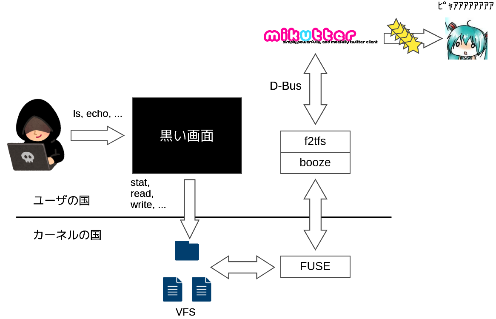

# F2TFS



## Requirements

- https://github.com/zevweiss/booze
- https://github.com/toshia/mikutter-mode

Please apply the patches in patch directory in this repository.

## How to use

```
$ sudo DBUS_USER=$(whoami) DBUS_SESSION_BUS_ADDRESS=${DBUS_SESSION_BUS_ADDRESS} ./f2tfs.sh <mount point>
$ cd <mount point>
$ echo <USER ID> > user_id
$ (fav whatever tweet via file)
```
